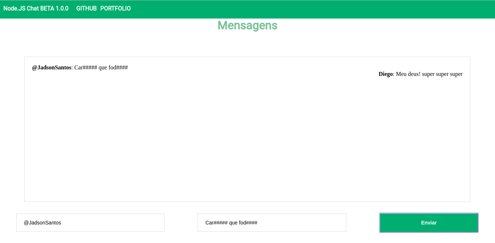

Node JS Chat
============

  
 

 

--- 
## Pague me um Café 

 

Se você usa este projeto, e aprendeu algo com ele ou simplesmente gostou dele, considere apoiá-lo comprando um café para mim, para que eu possa dedicar mais tempo a projetos de código aberto como este 😍.

---

Funcionalidades
===

- Suporte a emojis

Configuração
====

Clone este respositório para usar em seu desktop e rode o comando `npm install` para instalar todas as dependencias do projeto.

Para Usar
===
Depois que você clonou este repositório para seu desktop, vá para o  diretório raiz do projeto e rode o comando `npm start` e acesse [http://0.0.0.0:3000](http://0.0.0.0:3000)

Licença
===
> Para você saber mais sobre a licença, clique [aqui](https://github.com/jadson179CHAT-SOCKET-IO/master/LICENSE)

Este projeto é licenciado pelos os termos da licença MIT .